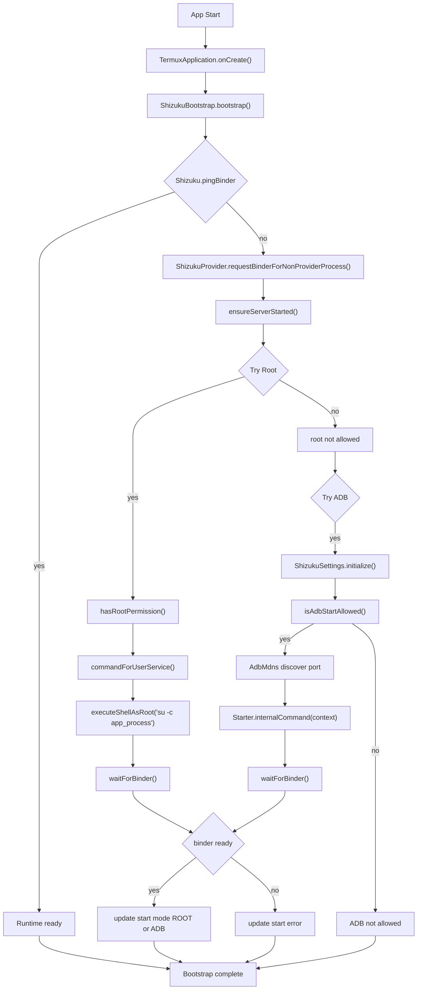
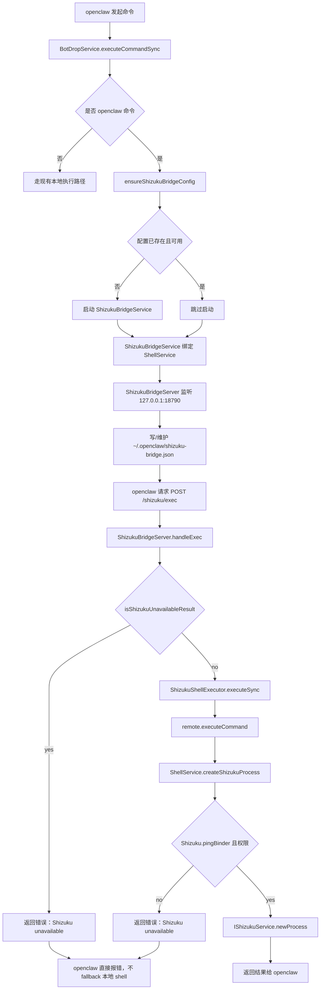
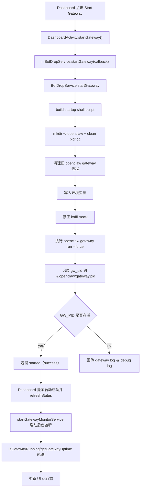
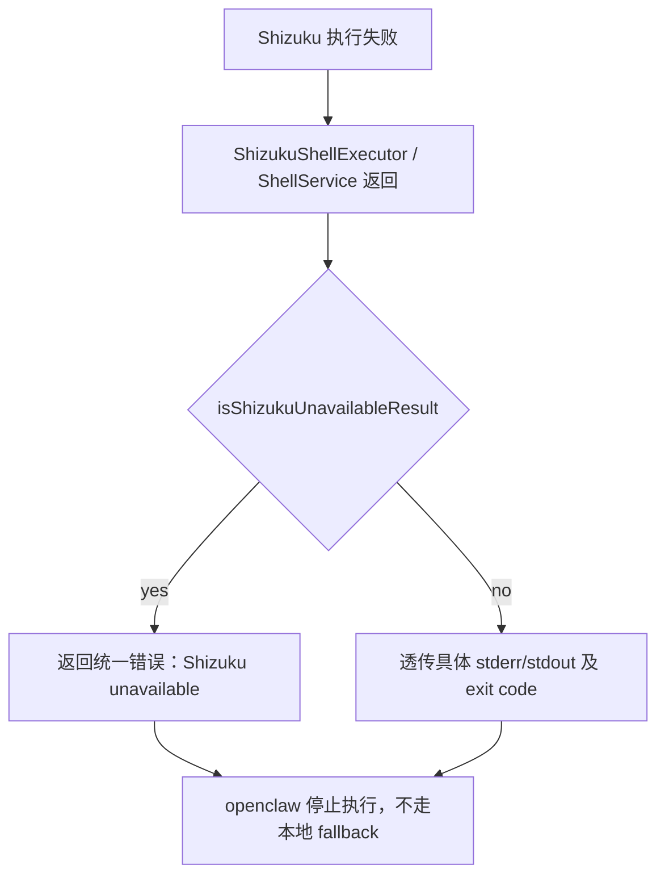
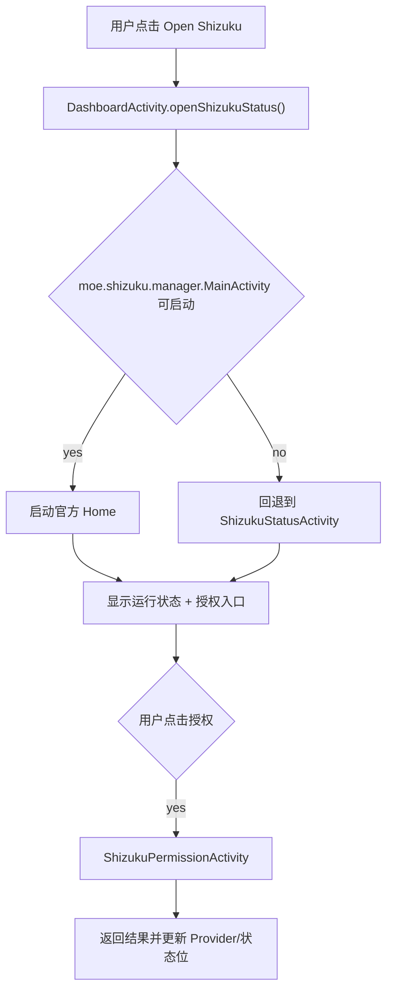

# BotDrop 单 App Shizuku 集成设计文档

版本：`feat/shizuku-single-app-merge`  
更新日期：2026-02-20（含 `/tmp/Shizuku-official` 对齐修订）

本文档定义当前 BotDrop 里将 Shizuku 运行时与执行桥接内嵌到同一个 APK 的设计、启动路径和执行路径。目标是在不再依赖独立 Shizuku App 的前提下，保留官方 Shizuku 的能力并让 openclaw 命令走同源可控通道。

## 1. 设计目标

- 单 APK 内完成 Shizuku runtime 的启动与桥接，不再要求用户安装独立 `moe.shizuku.privilege` 应用。
- 保持现有 BotDrop 功能不回退，openclaw 在可用时优先走 Shizuku 执行路径。
- 当 Shizuku 不可用时返回 `Shizuku unavailable` 并中止该命令执行（不自动回退本地 shell）。
- 提供统一入口查看状态：官方 Home（若存在）与 Shizuku 状态页。
- 将 openclaw 与 Shizuku 的联动方式标准化到本地配置文件 `~/.openclaw/shizuku-bridge.json`。

## 2. 关键组件与职责

### 2.1 运行时初始化（官方路径）

- `com.termux.app.TermuxApplication`
  - 应用进程启动时在 `onCreate()` 中调用 `ShizukuBootstrap.bootstrap(context)`。
- `com.termux.shizuku.ShizukuBootstrap`
  - 先尝试 `ShizukuProvider.requestBinderForNonProviderProcess(context)` 获取 binder。
  - `Shizuku.pingBinder()` 不可用时进入 `ensureServerStarted(context)`。
  - 优先尝试 root 与 adb 两条启动路径，均通过 `waitForBinder(context)` 进行握手确认并持久化启动状态：
    - Root：`ServiceStarter.commandForUserService(...)` + `executeShellAsRoot`，执行 `app_process` 启动 `moe.shizuku.server.ShizukuService`；
    - adb：`ShizukuSettings.initialize(context)` + `AdbMdns` + `Starter.internalCommand(context)`。

### 2.1.1 官方对齐修订（已登记）

- `EXTRA_BINDER` key 与 `sendBinder()` 交互统一为官方值 `moe.shizuku.privileged.api.intent.extra.BINDER`（含 `ServiceStarter` 与 `ShizukuManagerProvider`）。  
- `ServiceStarter.sendBinder()` 增加官方风格响应校验：`reply.setClassLoader(...)`，并校验返回 binder 非空且 `pingBinder()` 成功。  
- 非 root adb 路径要求 `ShizukuSettings.initialize(context)` 先于 `getPreferences()` 使用。

### 2.2 Shizuku Provider / Receiver

- `AndroidManifest.xml`
  - 声明 `rikka.shizuku.ShizukuProvider`（authority: `${TERMUX_PACKAGE_NAME}.shizuku`）。
  - 声明 `com.termux.shizuku.ShizukuReceiver`（action `rikka.shizuku.intent.action.REQUEST_BINDER`）。
- `com.termux.shizuku.ShizukuReceiver`
  - 负责接收 provider 的 binder 请求并返回本进程 `Shizuku.getBinder()`。

### 2.3 本地桥接层（Embedded Shizuku Bridge）

- `app.botdrop.shizuku.ShizukuBridgeService`
  - 前台服务，负责启动 `ShizukuBridgeServer`，并写入 `~/.openclaw/shizuku-bridge.json`。
- `app.botdrop.shizuku.ShizukuBridgeServer`
  - 监听 `127.0.0.1:18790`（`/shizuku/status`, `/shizuku/exec`）；
  - 鉴权 token 校验 + 结果回写 JSON；
  - Shizuku 通路不可用时返回不可用错误，不做本地 fallback。
- `app.botdrop.shizuku.ShizukuShellExecutor`
  - 与 `ShellService` 的 AIDL 通道 (`IShellService`) 交互；
  - 提供连接、重连与结果解析能力。
- `app.botdrop.shizuku.ShellService`
  - 应用内 AIDL 服务，执行真实命令时优先走 Shizuku API；
  - 成功时调用 `IShizukuService.newProcess(...)`；
  - 失败时返回明确错误字符串（如 `Shizuku permission not granted`）。
- `app.botdrop.shizuku.IShellService`
  - 本地 AIDL 接口：`executeCommand` + `destroy`。

### 2.4 BotDrop 命令路由

- `app.botdrop.BotDropService`
  - 命令分发入口：`executeCommandSync(...)`；
  - openclaw 命令优先走 Shizuku 桥接：
    - `ensureShizukuBridgeConfig()` 启动桥接；
    - `ShizukuShellExecutor.executeSync(...)`；
    - 失败时判断为 `unavailable` 后直接返回不可用错误，不走本地 fallback。
- `app.botdrop.GatewayMonitorService`
  - 保活网关运行态；不直接实现 Shizuku 执行逻辑，但与 command 路径串联。
- `app.botdrop.DashboardActivity`
  - 提供“Open Shizuku”入口；
  - 启动桥接服务（`startShizukuBridgeService()`）；
  - 打开官方/内置 Shizuku 状态页（`ShizukuStatusActivity`）。

## 3. 流程图

### 3.1 全局启动流程

### 3.2 OpenClaw 命令执行流程

### 3.3 OpenClaw Gateway 启动流程

### 3.4 降级与回退

### 3.5 Dashboard -> 官方 Home / 状态页入口

## 4. 关键实现点（Method 级）

### 4.1 `ShizukuBootstrap.bootstrap(context)`
- `ShizukuProvider.enableMultiProcessSupport(false)`
- `ShizukuProvider.requestBinderForNonProviderProcess(context)`
- `Shizuku.pingBinder()` 短路返回
- 失败时进入 `ensureServerStarted(context)`，尝试：
  - `startWithRoot()`：`hasRootPermission()`、`ServiceStarter.commandForUserService(...)`、`executeShellAsRoot(command)`、`waitForBinder(context)`；
  - `startWithAdb()`：`ShizukuSettings.initialize(context)`、`isAdbStartAllowed()`、`AdbMdns`、`Starter.internalCommand(context)`、`waitForBinder(context)`。

### 4.2 `BotDropService.executeCommandSync(command, timeoutSeconds)`
- 对 openclaw 命令统一走：
  - `ensureShizukuBridgeConfig()`；
  - `executeCommandViaShizuku(safeCommand, timeoutMs)`；
- `isShizukuUnavailableResult(result)` 判定返回；
  - `unavailable` 直接返回错误，不回退。

### 4.3 `ShizukuBridgeServer.handleExec`
- 解析 JSON body：`command`, `timeoutMs`, 可选 `env`；
- token 校验失败返回 `401`;
- 若 executor 可用，优先执行 `mExecutor.executeSync`;
- 关键异常直接返回不可用：
  - `Shizuku unavailable: ...`
- 不执行本地 fallback。

### 4.4 `ShellService.createShizukuProcess`
- 关键检查：
  - `Shizuku.pingBinder()`
  - `Shizuku.checkSelfPermission() == PERMISSION_GRANTED`
- 执行：
  - `IShizukuService.Stub.asInterface(Shizuku.getBinder())`
  - `service.newProcess(selectCommand(command), env, null)`
- 失败返回统一 stderr，便于网关链路诊断。

## 5. 配置与入口

- 网桥配置文件：`~/.openclaw/shizuku-bridge.json`
  - `host: 127.0.0.1`
  - `port: 18790`
  - `token: <random>`
- Dashboard：
  - “Open Shizuku”按钮 → `DashboardActivity.openShizukuStatus()`
    - 优先尝试启动内部 `moe.shizuku.manager.MainActivity`（存在则启动）；
    - 失败则打开 `ShizukuStatusActivity`（自动启动运行时+请求权限）。

## 6. 与官方 Shizuku 的一致性与偏差

- 一致性
  - 保留官方 runtime 类与协议链（`ShizukuProvider`, `Shizuku`, `IShizukuService`）。
  - 通过 `ServiceStarter`/`commandForUserService` 完成 server 级启动。
  - 权限确认仍走 `Shizuku.requestPermission` 与 `ShizukuPermissionActivity`。
- 偏差
  - 官方“独立应用”模式下，runtime 与管理 UI 分离安装；
  - 当前实现是单 App 内嵌模型：管理入口和 gateway 桥接共同存在于 BotDrop 包内。
  - 当前与官方差异集中在非 root 回退链路：`EXTRA_BINDER` 常量、`sendBinder` 回包校验、`ShizukuSettings` 初始化时序；这三点为当前稳定性关键项。

## 7. 风险与验证点

### 7.1 风险
- Shizuku 权限未授予导致所有 `newProcess` 失败；
- Root 丢失导致 runtime 无法启动；
- `ShizukuBridgeService` 被系统回收后，bridge 配置文件丢失；
- `openclaw` 与 shizuku 不可用错误的可观测性不足（需命令级日志）。

### 7.2 验证项
- 启动日志应出现：
  - `ShizukuBootstrap.bootstrap`
  - `ShizukuBridgeService` `Start command`
  - `ShizukuBridgeServer started on 127.0.0.1:18790`
  - `writeBridgeConfig ... shizuku-bridge.json`
- `ShizukuPermissionActivity` 出现时，确认当前应用授权状态。
- openclaw 路径命令日志应显示执行分支：
  - `execute via shizuku bridge`
  - `Shizuku unavailable`（仅在确实失败时出现）。

## 8. 后续迭代建议

1. 将 `ShizukuManager` 与官方状态 API 对齐（补齐真实状态映射：NOT_INSTALLED / NOT_RUNNING / NO_PERMISSION / READY）；
2. 在 `ShizukuBridgeServer` 增加 request_id 和标准响应码；
3. 增加官方 home 入口与内嵌入口的统一跳转策略（减少重复弹窗）；
4. 将 `isShizukuUnavailableResult` 与标准错误码归一化，提升故障自恢复比率。
